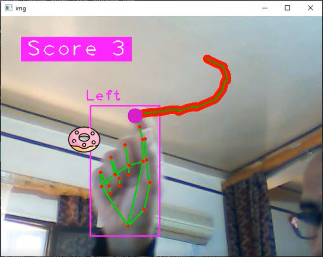

# Snake game based on openCv and python using libraries(Mediapipe and Cvzone)
In this project i share with you a computer vision project which is a snake game.the finger of my hand will be the head , in each time when i eat the donut the score will incremented and the length size augmented.

When the head hit the body snake i lost , to restart the game again i press r button in the key borad.

# The important libraries
to install these libraries we type these commands :
-	Pip install python open-cv (to deal with the real time streaming)
-	Pip install python mediapipe (to determine the hand and the finger position)
-	Pip install python cvzone (to show the score and final result after you lose)

The project contains two class :
-	Main class which contains an infinite loop for real time streaming
-	Snake game class which allows us to handle the length snake, score and the random position donut

# The video explanation
https://youtu.be/UCPkJm5qpUU

